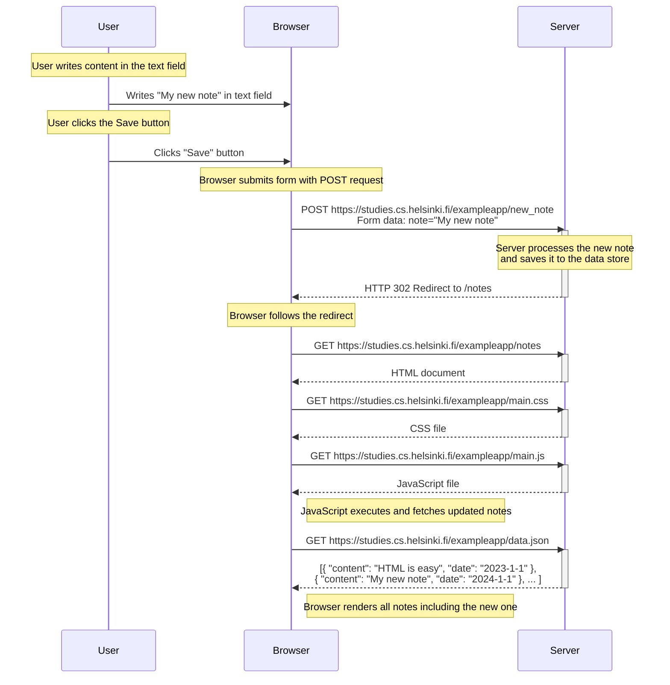

```mermaid
sequenceDiagram
    participant user as User
    participant browser as Browser
    participant server as Server

    Note over user: User writes content in the text field
    user->>browser: Writes "My new note" in text field
    
    Note over user: User clicks the Save button
    user->>browser: Clicks "Save" button
    
    Note over browser: Browser submits form with POST request
    browser->>server: POST https://studies.cs.helsinki.fi/exampleapp/new_note<br/>Form data: note="My new note"
    activate server
    
    Note over server: Server processes the new note<br/>and saves it to the data store
    server-->>browser: HTTP 302 Redirect to /notes
    deactivate server
    
    Note over browser: Browser follows the redirect
    browser->>server: GET https://studies.cs.helsinki.fi/exampleapp/notes
    activate server
    server-->>browser: HTML document
    deactivate server
    
    browser->>server: GET https://studies.cs.helsinki.fi/exampleapp/main.css
    activate server
    server-->>browser: CSS file
    deactivate server
    
    browser->>server: GET https://studies.cs.helsinki.fi/exampleapp/main.js
    activate server
    server-->>browser: JavaScript file
    deactivate server
    
    Note right of browser: JavaScript executes and fetches updated notes
    browser->>server: GET https://studies.cs.helsinki.fi/exampleapp/data.json
    activate server
    server-->>browser: [{ "content": "HTML is easy", "date": "2023-1-1" },<br/>{ "content": "My new note", "date": "2024-1-1" }, ... ]
    deactivate server
    
    Note right of browser: Browser renders all notes including the new one
    
```
