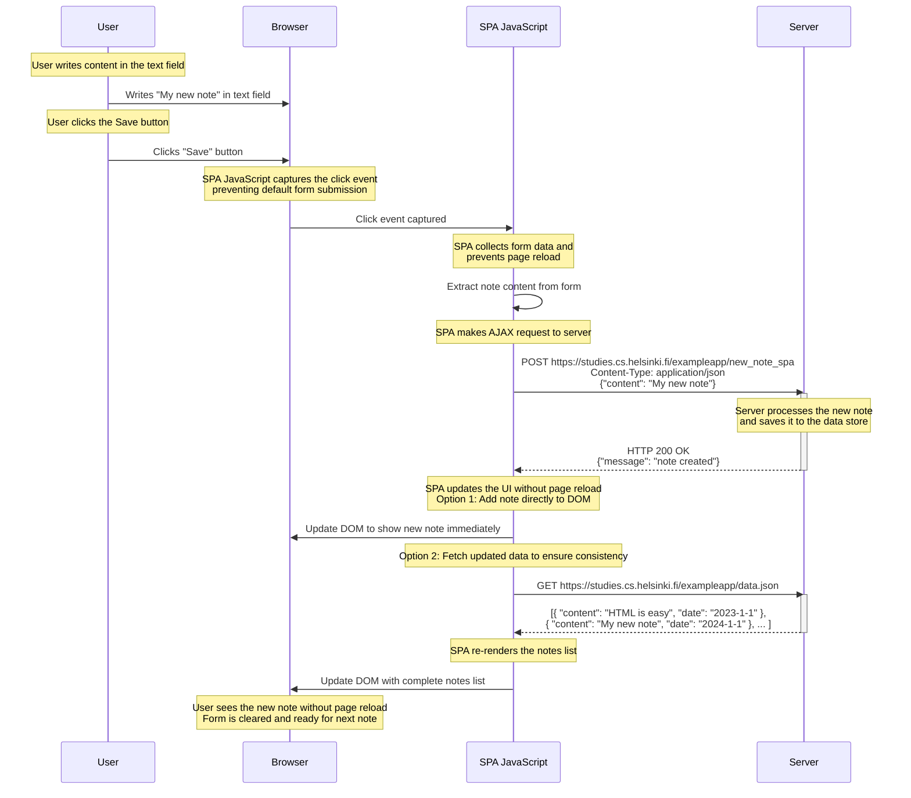

```mermaid
sequenceDiagram
    participant user as User
    participant browser as Browser
    participant spa as SPA JavaScript
    participant server as Server

    Note over user: User writes content in the text field
    user->>browser: Writes "My new note" in text field
    
    Note over user: User clicks the Save button
    user->>browser: Clicks "Save" button
    
    Note over browser: SPA JavaScript captures the click event<br/>preventing default form submission
    browser->>spa: Click event captured
    
    Note over spa: SPA collects form data and<br/>prevents page reload
    spa->>spa: Extract note content from form
    
    Note over spa: SPA makes AJAX request to server
    spa->>server: POST https://studies.cs.helsinki.fi/exampleapp/new_note_spa<br/>Content-Type: application/json<br/>{"content": "My new note"}
    activate server
    
    Note over server: Server processes the new note<br/>and saves it to the data store
    server-->>spa: HTTP 200 OK<br/>{"message": "note created"}
    deactivate server
    
    Note over spa: SPA updates the UI without page reload<br/>Option 1: Add note directly to DOM
    spa->>browser: Update DOM to show new note immediately
    
    Note over spa: Option 2: Fetch updated data to ensure consistency
    spa->>server: GET https://studies.cs.helsinki.fi/exampleapp/data.json
    activate server
    server-->>spa: [{ "content": "HTML is easy", "date": "2023-1-1" },<br/>{ "content": "My new note", "date": "2024-1-1" }, ... ]
    deactivate server
    
    Note over spa: SPA re-renders the notes list
    spa->>browser: Update DOM with complete notes list
    
    Note over browser: User sees the new note without page reload<br/>Form is cleared and ready for next note
```
