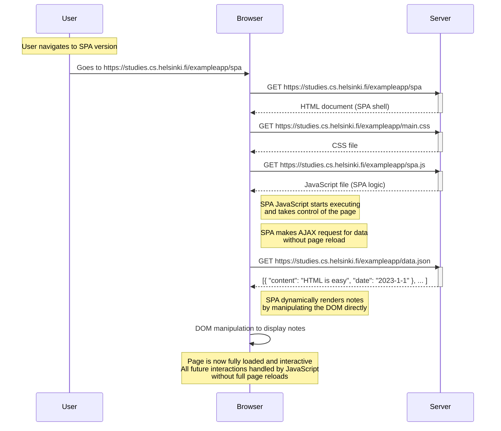

```mermaid
sequenceDiagram
    participant user as User
    participant browser as Browser  
    participant server as Server

    Note over user: User navigates to SPA version
    user->>browser: Goes to https://studies.cs.helsinki.fi/exampleapp/spa
    
    browser->>server: GET https://studies.cs.helsinki.fi/exampleapp/spa
    activate server
    server-->>browser: HTML document (SPA shell)
    deactivate server
    
    browser->>server: GET https://studies.cs.helsinki.fi/exampleapp/main.css
    activate server
    server-->>browser: CSS file
    deactivate server
    
    browser->>server: GET https://studies.cs.helsinki.fi/exampleapp/spa.js
    activate server
    server-->>browser: JavaScript file (SPA logic)
    deactivate server
    
    Note right of browser: SPA JavaScript starts executing<br/>and takes control of the page
    
    Note right of browser: SPA makes AJAX request for data<br/>without page reload
    browser->>server: GET https://studies.cs.helsinki.fi/exampleapp/data.json
    activate server
    server-->>browser: [{ "content": "HTML is easy", "date": "2023-1-1" }, ... ]
    deactivate server
    
    Note right of browser: SPA dynamically renders notes<br/>by manipulating the DOM directly
    browser->>browser: DOM manipulation to display notes
    
    Note over browser: Page is now fully loaded and interactive<br/>All future interactions handled by JavaScript<br/>without full page reloads
```
